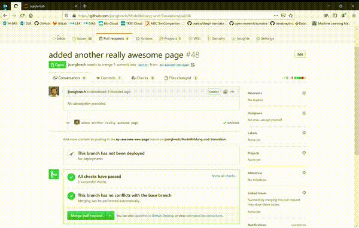

# Contribution Guide


<details>
<summary>Initial Setup</summary>

I have tested this on Linux, though it should work on Windows and Mac as well. For Windows 10, working with the [Windows Linux Subsystem](https://docs.microsoft.com/en-us/windows/wsl/install-win10) works really well, so I suggest you install e.g. **Ubuntu 18.04** on your Windows machine.

I suggest installing [miniconda3](https://docs.conda.io/en/latest/miniconda.html) via the provided bash script. It is a very good package manager that comes with Python and allows the creation of environments. This is *not really* necessary, but some of the commands below assume you have `conda` installed on your system.

#### Install prerequisites

This website is based on Jupyter-book, which lets you create a static website out of Markdown files and Jupyter notebooks. The Jupyter notebooks here use the Octave kernel. The webpage creation is done with ruby. So first, we need to install these prerequisites with `apt-get` and `conda`:

Install Octave, Jupyter and the Octave-kernel for jupyter:

```bash
sudo apt-get install octave
conda install jupyter jupyterlab
conda install octave_kernel -c conda-forge
```

Install Ruby and its requirements:

```bash
sudo apt-get install gcc g++ zlib1g-dev ruby-dev
sudo gem install bundler
sudo gem update --system
```

Note, that Ruby is only needed to preview the webpage locally, since the webpage is built with every commit to this repository using github-pages.

#### Install MOxUnit

For some Matlab exercises, unit tests are provided. This page teaches Matlab but uses Octave under the hood. Because the unit testing frameworks of Matlab and Octave are not
compatible to each other, we have to use a free unit testing framework that works with both Matlab and Octave, namely MOxUnit

```bash
git clone https://github.com/MOxUnit/MOxUnit
cd MOxUnit
make install
cd ..
```

#### Clone this repository to your local machine

 ```bash
 git clone https://github.com/joergbrech/Modellbildung-und-Simulation
 cd Modellbildung-und-Simulation
 ```
 
Install some Ruby requirements of this book that are needed to preview the website locally

```bash
bundle install
```

bundler might ask you for your sudo password here. Now install the python requirements:

```bash
pip install -r requirements.txt
```

Currently, the only requirement is `jupyter-book`.

</details>

## Contribution Workflow

In this section, it is assumed that you are in the root directory of your clone of this repository, i.e. in `Modellbildung-und-Simulation`.

#### Create a feature branch
 
 * Switch to the master branch and fetch the latest changes from this repository
 ```bash
 git checkout master
 git pull
 ```
 * Create a new branch and switch to it
 ```bash
 git checkout -b my-awesome-new-page
 ```
 
#### Create or modify content

 * Navigate into the `content` subdirectory of the repository and create some markdown files and jupyter notebooks.
 ```bash
 cd content
 jupyter-lab .
 ```
 Jupyter-lab (or jupyter-notebook) runs in the browser. If your browser does not start automatically, you might have to copy the url from the command line output to your favorite browser. 
 * Create new Markdown files or jupyter notebooks or edit the ones that are already there. Check the [wiki](https://github.com/joergbrech/Modellbildung-und-Simulation/wiki) for writing conventions *(in German)*.
 * Edit `_data/toc.yml` to include any newly created content files in the table of contents. Most likely, these are the only places where changes need to be made. For more sophisticated changes, checkout the [jupyter-book documentation](https://jupyter.org/jupyter-book/guide/01_overview) and the [demo notebook](https://jupyterbook.org/intro.html).
 * Back in the root directory, run
 ```bash
 make book
 ```
 to convert the Jupyter notebooks and markdown files and copy the results to the `_build` directory.
 
#### Review your changes and push them upstream
 
 * With
 ```bash
 make serve
 ```
 the html-version can be checked locally. Simply copy the url from the command line output to your favorite browser.
 * Stage and commit your changes:
 ```bash
 git add .
 git commit -m "added another really awesome page"
 ```

 * Push your changes to this repository to publish the changes. If your newly created branch `my-awesome-new-page` only exists locally, you need to associate a new upstream branch to your local copy.
 ```bash
 git push -u origin HEAD
 ```
 This only needs to be done once per branch. Afterwards,
 ```bash
 git push
 ```
 suffices.
 * Once you are fully satisfied with the changes, go to Github and create a Pull-Request from your branch.

### Review the final result online

This repository uses Circle CI to build a demo site with each `git push`. This way you can see the effect that your commits will have on the website, even before your changes are merged into the master branch.



 * If the book generation failed for some reason, there will be a red cross instead of a green check mark. You can click on the red cross to see what went wrong.
 * Note that the *Artifacts* tab is only visible if you are a registered member in Circle CI, your Circle CI account is connected to your Github account and you are logged in. By default, Circle CI uses a temporary user account.
