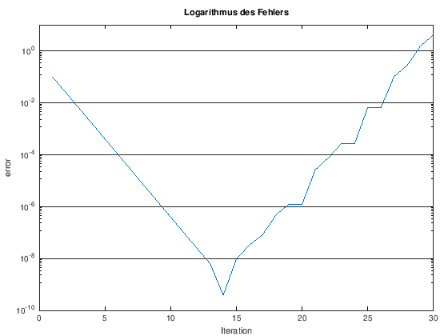

---
redirect_from:
  - "/00-einleitung/exercises-01-factorial-pi"
interact_link: content/00_einleitung/exercises_01_factorial_pi.ipynb
kernel_name: octave
title: 'Matlab/Octave'
prev_page:
  url: /00_einleitung/exercises_00_intro
  title: 'Übungsaugaben'
next_page:
  url: /emptypage
  title: 'Flüssigkeit im Boden'
comment: "***PROGRAMMATICALLY GENERATED, DO NOT EDIT. SEE ORIGINAL FILES IN /content***"
---

# 1. Machen Sie sich vertraut mit Matlab


Lesen Sie sich die Kapitel [*Verwendung dieses Buches*](/Modellbildung-und-Simulation/00_einleitung/usage) und [*Erste Schritte in Matlab*](/Modellbildung-und-Simulation/00_einleitung/matlab_00_first_steps) durch. Können Sie die folgenden Fragen beantworten?

1. Beschreiben Sie die Funktionalität des *Command Window*, *Editor* und *Workspace* in Matlab.
1. Was ist der Unterschied zwischen einer Funktion und einem Skript?
2. Was verbirgt sich hinter dem Wort *scope*?
3. Was ist ein *function handle*?
4. Aus welchen Gründen sollte ich for-Schleifen vermeiden?
3. Was ist das Grundprinzip hinter dem *Bisektionsverfahren*?
3. Wie kann ich die Operationen `*` bzw. `^` elementweise ausführen?
3. Warum sollte ich reelle Zahlen nie mit `==` auf Gleichheit prüfen?
3. Was bedeutet logische Indizierung?
3. Wie kann ich eine Matrix transponieren?
3. Warum sollte ich strings nie mit `==` auf Gleichheit prüfen?
4. Was bewirkt der Befehl `hold on`?

# 2. Binominialkoeffizienten

**To Do** siehe Handout


{:.input_area}
```matlab
%% fac.m
% calculate the factorial of an integer n
function z = fac(n)
    if n==0
        z=1;
    else
        z=n*fac(n-1);
    end
end
```


{:.input_area}
```matlab
n=5;
k=3;
fac(n)/(fac(k)*fac(n-k))
```


{:.output .output_stream}
```
ans =  10

```

# 3. Rundungsfehler

**To Do** siehe Handout


{:.input_area}
```matlab
max_iter=30;            % Anzahl der Iterationen
z = zeros(max_iter,1);  % Initialisiere Vektor für z aus Effizienzgründen
err = zeros(max_iter,1);% Initialisiere Vektor für err aus Effizienzgründen

z(1)=2*sqrt(2);         %Anfangswerte
err(1)=abs(pi-z(1))/pi;

for n=1:max_iter-1
    z(n+1)=2^(n+1.5)*sqrt(1-sqrt(1-4^(-n-1)*z(n)^2));
    err(n+1)=abs(pi-z(n+1))/pi;
end
```


Logarithmische Darstellung des Fehlers


{:.input_area}
```matlab
semilogy(err)
title('Logarithmus des Fehlers')
xlabel('Iteration')
ylabel('error')
set(gca, 'ygrid', 'on')
```


{:.output .output_png}



