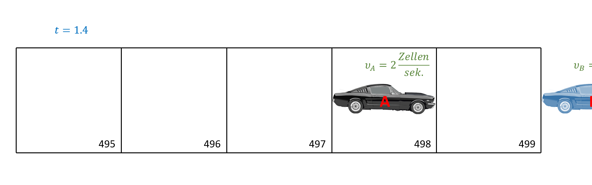
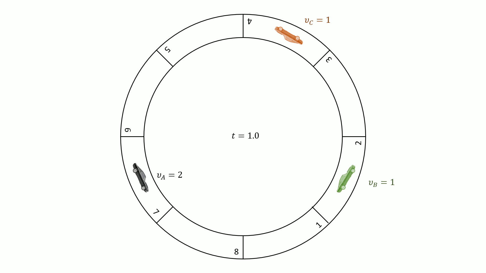

---
redirect_from:
  - "/00-einleitung/exercises-03-verkehrssimulation"
interact_link: content/00_einleitung/exercises_03_verkehrssimulation.ipynb
kernel_name: octave
has_widgets: false
title: 'Verkehrssimulation'
prev_page:
  url: /00_einleitung/exercises_02_fluessigkeit
  title: 'Flüssigkeit im Boden'
next_page:
  url: /emptypage
  title: 'Conway's Game of Life'
comment: "***PROGRAMMATICALLY GENERATED, DO NOT EDIT. SEE ORIGINAL FILES IN /content***"
---

# Verkehrssimulation

In dieser Übungsaufgabe soll das Fahrverhalten von Autofahrern und die damit einhergehende Stauentwicklung modelliert werden. In einem 7,5 km langen einspurigen Tunnel bilden sich zu Hauptverkehrszeiten immer wieder Staus, ohne dass ein Unfall oder eine Baustelle als Ursache ausgemacht werden kann. Ampeln gibt es auf der gesamten Strecke nicht. Ihre Aufgabe ist ein simples Computermodell zu erstellen, das in der Lage ist dieses Phänomen zu reproduzieren. Welche Durchschnittsgeschwindigkeit kann man bei einer gegebenen Verkehrsdichte erwarten? Wie hängt der Verkehrsfluss von der Verkehrsdichte ab?


## Modellbeschreibung

Im Durchschnitt belegt ein Fahrzeug ca. 7,5 m der Strecke in einem Stau. Diese Länge beinhaltet bereits den Abstand zum Auto davor. Die 7,5 km lange Strecke lässt sich demnach in 1000 Zellen zerlegen. Zu jedem Zeitpunkt ist eine Zelle entweder frei oder von einem Auto belegt. In den Tunnel passen maximal 1000 Fahrzeuge. Abbildung 1 zeigt beispielhaft einen Streckenabschnitt aus 10 Zellen mit 5 Fahrzeugen A, B, C, D und E. In Abbildung 1(a) ist der Streckenabschnitt dargestellt. Die Zellen 2, 3, 5, 8 und 10 sind jeweils mit einem Auto belegt. Abbildung 1(b) zeigt eine komprimierte Darstellung. In einem Positionsvektor werden die Zellennummern der 5 Fahrzeuge gespeichert.
Ein Fahrzeug mit einer Geschwindigkeit von 27 km/h = 7, 5 m/s rückt innerhalb einer Sekunde genau eine Zelle vor. Die Maximalgeschwindigkeit im Tunnel beträgt 135 km/h, bzw. 5 Zellen pro Sekunde. Simulieren Sie den Verkehrsfluss sekundenweise. Dies entspricht in etwa der Reaktionszeit eines Autofahrers. In jedem Zeitschritt von einer Sekunde ergibt sich die Position und Geschwindigkeit eines Fahrzeuges nach folgenden einfachen Regeln, die in der angegebenen Reihenfolge umgesetzt werden:
1. Jedes Auto, das noch nicht die Maximalgeschwindigkeit erreicht hat, erhöht seine Geschwindigkeit um eine Zelle pro Sekunde.

2. Falls die Geschwindigkeit eines Fahrzeuges zu einer Kollision mit dem Fahrzeug davor führen würde, reduziert sich die Geschwindigkeit entsprechend. Beispiel: Fahrzeug A befindet sich in Zelle 500 und hat eine Geschwindigkeit von 4 Zellen pro Sekunde. Zelle 503 ist aber von Fahrzeug B belegt. Demnach reduziert sich die Geschwindigkeit von Fahrzeug A auf 2 Zellen pro Sekunde.


3. Ein Anteil pSF der Fahrer auf dem Streckenabschnitt sind Sonntagsfahrer. Deren Geschwindigkeit reduziert sich um eine Zelle pro Sekunde, sofern sie nicht schon stehen.

4. Alle Fahrzeuge rücken entsprechend ihrer Geschwindigkeit vor.
Die Verkehrsdichte im betrachteten Zeitraum bleibe annähernd konstant. Zu jeder Zeit verlassen also so viele Autos den Steckenabschnitt wie neue hinzu kommen. Um diesen Effekt zu berücksichtigen, bedienen sie sich eines Tricks: Gehen Sie von periodischen Randbedingungen aus. Sobald ein Auto die 7,5 km lange Strecke verlässt, taucht es am Anfang wieder auf (In anderen Worten: Die Zellen mit den Nummern i und 1000+i sind identisch). Eine Anschauung des Tricks ist es, sich den Tunnel als Ringstraße mit einem Umfang von 7, 5 km vorzustellen.


## Aufgabe 1

1. Erstellen Sie ein Matlab–Skript, das zunächst die folgenden Parameter festlegt: 
    - normalisierte Verkehrsdichte ρ 
    - Maximalgeschwindigkeit vmax (Zellen/Sekunde) 
    - Anteil Sonntagsfahrer pSF 
    - Streckenlänge L (Anzahl von Zellen) 
    - Simulationszeitraum T (Sekunden)


2. Die normalisierte Verkehrsdichte ρ ist der Anteil der belegten Zellen, also eine einheitslose Zahl zwischen 0 und 1.
    - Berechnen Sie die Anzahl der Fahrzeuge n aus der Streckenlänge L und der normalisierten Verkehrsdichte ρ und erzeugen Sie zwei Vektoren pos und vel der Länge n für die Positionen (Zellennummer) und Geschwindigkeiten (Zellen/Sekunde) der Fahrzeuge. Zu Beginn der Simulation sind die Autos beliebig auf der Strecke verteilt. Die Anfangsgeschwindigkeit aller Fahrzeuge beträgt 0 Zellen/Sekunde. **Tipp**: Schauen Sie sich die Matlab–Funktion randperm(m,n) an. Sortieren sie den Vektor pos zu Beginn der Simulation aufsteigend.
    - Berechnen sie die Positionen pos und Geschwindigkeiten vel aller Fahrzeuge nach den vier oben genannten Regeln für jede Sekunde innerhalb einer Stunde. Tipp: Für die Umsetzung der periodischen Randbedingungen könnte die Funktion mod(k, n) hilfreich sein. Für die Umsetzung von Regel 3 bietet sich wieder randperm(n, k) an.
    - Animieren Sie den Verkehrsfluss um zu überprüfen, ob ihr Modell funktioniert. Gehen Sie dabei von einer Maximalgeschwindigkeit von 5 Zellen/Sekunde, pSF = 0.2 sowie einer normalisierten Verkehrsdichte von ρ = 0.4 aus. **Tipp**: Eine Animation kann zum Beispiel mit den Matlab–Funktionen scatter und pause(t) in der Hauptschleife ihres Programmes erzeugt werden.

<div markdown="1" class="cell code_cell">
<div class="input_area" markdown="1">
```matlab
%% input parameters
density     = 0.4;    % the ratio of road cells occupied by a car
max_speed   = 5;      % the maximally posible speed [cells/second]
p_SF        = 0.20;   % the ratio of 'sunday drivers'
len         = 1000;   % the length of the road [cells]
T           = 3600;   % the simulation time [seconds]

    %<<<<<< ADD YOUR CODE HERE >>>>>>%

%% initial configuration

    %<<<<<< ADD YOUR CODE HERE >>>>>>%

%% main time loop
for t=1:T
    %1.) increase speed of all cars by one

        %<<<<<< ADD YOUR CODE HERE >>>>>>%
    
    %2.) decrease speed if it would cause a collision otherwise

        %<<<<<< ADD YOUR CODE HERE >>>>>>%
    
    %3.) decrease velocity of a random selection 
    %    of p_SF*num_cars by 1
    
        %<<<<<< ADD YOUR CODE HERE >>>>>>%
    
    %4.) move cars according to their speed

        %<<<<<< ADD YOUR CODE HERE >>>>>>%
    
    %5.) animate
    
        %<<<<<< ADD YOUR CODE HERE >>>>>>%
end;
```
</div>

</div>

## Aufgabe 2

Wandeln Sie ihr Skript in eine Matlab–Funktion um, die beim Aufruf eine Simulation ausführt. Die Funktion erhält als Eingabe – normalisierte Verkehrsdichte ρ, – Maximalgeschwindigkeit vmax, – Anteil der Sonntagsfahrer pSF
und gibt – die durchschnittliche Geschwindigkeit vmean – den durchschnittlichen Verkehrsfluss Q
als Ausgabe aus. Legen Sie T = 3600 Sekunden und L = 1000 Zellen fest. Der Verkehrsfluss Q entspricht der Anzahl an Autos, die pro Zeiteinheit einen Zähler passieren, z.B. zwischen Zelle 1000 und 1.
- Um Rechenzeit zu sparen, deaktivieren Sie die Animation aus Aufgabenteil (a). • In einem weiteren Matlab–Skript berechnen Sie für normalisierte Verkehrsdichten ρ = 0.05, 0.10, 0.15, 0.20, ..., 1 den Verkehrsfluss Q und die durchschnittliche Geschwindigkeit vmean mit Hilfe dieser Matlab Funktion. Gehen Sie von pSF = 0.2 und vmax = 5 Zellen/Sekunde aus.
- Erstellen Sie mit ihrem Skript sowohl ein ρ–vmean–Diagramm als auch ein ρ–Q–Diagramm um die Abhängigkeiten des Verkehrsflusses bzw. der Durchschnittsgeschwindigkeit von der Verkehrsdichte darzustellen.

## Aufgabe 3
Experimentieren Sie mit den Parametern vmax und pSF. Wie lässt sich der Einfluss beider Parameter auf die Durchschnittsgeschwindigkeit und den Verkehrsfluss qualitativ beschreiben? Nennen sie eine Möglichkeit den Realismus des Modells zu steigen.
