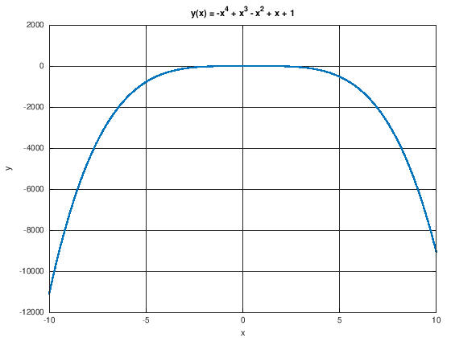

---
redirect_from:
  - "/00-einleitung/matlab-02-scripts-and-functions"
interact_link: content/00_einleitung/matlab_02_scripts_and_functions.ipynb
kernel_name: octave
title: 'Skripte und Funktionen'
prev_page:
  url: /00_einleitung/matlab_01_command_window
  title: 'Matlab Command Window'
next_page:
  url: /00_einleitung/matlab_03_best_practice
  title: 'Best Practices'
comment: "***PROGRAMMATICALLY GENERATED, DO NOT EDIT. SEE ORIGINAL FILES IN /content***"
---

# Skripte und Funktionen

Bisher haben wir Befehle im `Command Window` eingeben und festgestellt, dass alle Variablen im `Workspace` hinterlegt werden. In diesem Kapitel widmen wir uns den `Editor`. Wir benutzen ihn um Skripte und Funktionen zu schreiben. Beide werden als Textdateien mit der Endung `.m` gespeichert. Prinzipiell können wir diese Textdateien mit jeden beliebigen Texteditor schreiben, Der Editor in Matlab bietet aber einige nützliche Funktionen. Allein *Syntax-Highlighting* kann schon sehr hilfreich sein.

## Skripte
 
Matlab-Skripte sind einfache Textdateien, die eine Abfolge von Matlab-Befehlen enthalten. Diese werden nach einander abgearbeitet. 

Das `%`-Zeichen läutet in Matlab einen Kommentar ein. Kommentare helfen dabei, die Skripte nachvollzubar zu machen. Wie in *ALLEN* Programmiersprachen gilt auch in MATLAB: **Kommentieren Sie ihren Code!**
Es kommt nicht selten vor, dass man nach Wochen in ein altes Matlab-Skript schaut, sich fragt was man damals eigentlich gemacht hat und sich wünscht, man hätte es besser kommentiert.


{:.input_area}
```matlab
%%file myScript.m
% Ein kleines Beispielskript
% mit Kommentaren

% Initialisiere Variablen a und b
a = 5;
b = 2*a;

% Ändere Variable a
a = a/2;

% Ausgabe erzwingen, durch weglassen des Semikolons am Ende der Zeile
a
b
```


{:.output .output_stream}
```
Created file '/home/jan/shares/Modellbildung-und-Simulation/content/00_einleitung/myScript.m'.

```

**Hinweis:** *Die allererste Zeile*

`%%file myScript.m` 

*besagt nur, dass alles was folgt Inhalt der Datei `myScript.m` ist. Der eigentliche Inhalt der Datei beginnt ab der darauf folgenden Zeile*

`% Ein kleines Beispielskript`.

Dieses Skript wird mit dem `run` Befehl ausgeführt.


{:.input_area}
```matlab
run myScript.m
```


{:.output .output_stream}
```
a =  2.5000
b =  10

```

Wir dürfen an dieser Stelle die Dateiendung `.m` weglassen. Tatsächlich ist der `run` Befehl auch nicht zwingend nötig. Die Befehle `run myScript.m`, `run myScript`, `myScript.m`, `myScript` haben alle denselben Effekt: Die Befehle in `myScript.m` werden ausgeführt.

Im Matlab-Editor kann das aktuell geöffnete Skript mit `F5` oder per Mausklick auf den großen grünen Play-Button gestartet werden.


Es bietet sich an, in den ersten paar Zeilen jedes Skriptes zu beschreiben, welchem Zweck das Skript dient. Diese ersten Zeilen lassen sich mit dem `help` Befehl ausgeben:


{:.input_area}
```matlab
help myScript.m
```


{:.output .output_stream}
```
'myScript.m' is the file /home/jan/shares/Modellbildung-und-Simulation/content/00_einleitung/myScript.m

 Ein kleines Beispielskript
 mit Kommentaren


Additional help for built-in functions and operators is
available in the online version of the manual.  Use the command
'doc <topic>' to search the manual index.

Help and information about Octave is also available on the WWW
at http://www.octave.org and via the help@octave.org
mailing list.

```

### for-Schleifen

Wie in anderen Programmiersprachen können in MATLAB auch Schleifen verwendet werden. Die Syntax für eine for-Schleife ist


{:.input_area}
```matlab
for i=1:5
    f(i)=2^i;
end
```


Der Code zwischen der `for`-  und der `end`-Zeile wird fünf mal ausgeführt. Bei jeder Ausführung wird eine *Laufvariable* `i` um Eins erhöht. Wir greifen in diesem Beispiel in jedem Durchlauf auf die $i$-te Stelle eines Vektors $f$ zu, und beschreiben diese Stelle mit $2^i$. Dabei wird der Vektor f automatisch in jedem Schleifendurchlauf um ein Element erweitert. Matlab macht den Vektor nur so groß, wie für die Ausführung des Befehls nötig ist. Es ist zu beachten, dass in MATLAB auf das erste Element eines Vektors mit dem Index 1 zugegriffen wird.

Es besteht die Möglichkeit die Schrittweite der Laufvariablen anzupassen. Auf diese Weise können auch Laufvariablen benutzt werden, die nicht ganzzahlig sind:


{:.input_area}
```matlab
for t=2*pi:-pi/2:0
    x = [cos(t), sin(t)]
end
```


{:.output .output_stream}
```
x =

   1.0000e+00  -2.4493e-16

x =

  -1.8370e-16  -1.0000e+00

x =

  -1.0000e+00   1.2246e-16

x =

   6.1232e-17   1.0000e+00

x =

   1   0


```

**Quiz:** Wie sieht der Vektor $f$ aus, der von folgender for-Schleife erzeugt wird?


{:.input_area}
```matlab
for i=1:2:5
    f(i)=2^i;
end
```


Bei for-Schleifen ist über die Laufvariable die Anzahl der Aufrufe vor dem Beginn der Schleife klar. Es ist zwar möglich, die Laufvariable selbst in der Schleife zu verändern, das sollte aber auf jeden Fall vermieden werden. Der Code wird dadurch nicht mehr intuitiv verständlich und es ist eine wahrscheinliche Fehlerquelle.

### while-Schleifen

while-Schleifen bieten eine weiter Möglichkeit, einen Code-Block wiederholt auszuführen. Eine while-Schleife solange ausgeführt, bis eine Aussage nicht mehr zutrifft. Dabei muss dem Programmierer vorher nicht bekannt sein, wieviele Schleifendurchläufe dafür nötig sind.


{:.input_area}
```matlab
x = pi/2;
while abs( sin(x)-x )/x > 0.01
    x = 0.99*x;
end
disp(x)
```


{:.output .output_stream}
```
 0.24470

```

Die Anweisung `x = 0.99*x` wird solange ausgeführt, bis $\lvert \sin(x) - x \rvert$ nicht mehr größer als $0.01$ ist.
Das kleine Programm schätzt auf eine etwas ungenaue Art ab, bis zu welchem Wert die Kleinwinkelnäherung $\sin(x) \approx x$ relative Fehler von unter $1 \%$ liefert. 

**Challenge:** Fallen Ihnen Wege ein, die Abschätzung genauer zu gestalten?

Eine for-Schleife kann immer in eine-while Schleife umgeschrieben werden. Folgende Code-Blöcke liefern das selbe Ergebnis:


{:.input_area}
```matlab
for i=1:5
    f(i)=2^i;
end
```


{:.input_area}
```matlab
i=1;
while i<=5
    f(i)=2^i;
    i = i+1;
end
```


**Best Practice:** Verwenden Sie while-Schleifen, wenn die Anzahl der Durchläufe unbekannt ist und for-Schleifen sonst.

### if-Abfragen

Oft ist es nützlich, Bestimmte Befehle nur auszuführen, wenn eine Bedingung erfüllt ist. Dies erreicht man mit if-Bedingungen.


{:.input_area}
```matlab
zaehler = rand();
nenner = rand();
if abs(nenner) > 1e-8
    x = zaehler/nenner
end
```


{:.output .output_stream}
```
x =  22.641

```

Der Codeblock erstellt nur dann eine Variable ´x´, wenn der Nenner des Bruchs größer als $10^{-8}$ ist. Wir sollten den Fall abfangen, wenn diese Bedingung mal nicht erfüllt wird. Dies erreicht man mit if-then-else-Bedingungen.


{:.input_area}
```matlab
zaehler = rand();
nenner = rand();
if abs(nenner) > 1e-8
    x = zaehler/nenner
else
    x = 1
end
```


{:.output .output_stream}
```
x =  0.79632

```

Es kann auch vorkommen, dass mehr als eine Bedingung abgefragt werden muss. In diesem Fall hilft eine if-then-elseif-else-Bedingungen. Das kann zum Beispiel Sinn machen, wenn eine Variable eine Kategorie beschreibt, wie zum Beispiel Tierarten, wie im folgendem Beispiel.


{:.input_area}
```matlab
%%file oldmcdonald.m
% make some animal noises

animal = "cow";

if strcmp(animal, "cat")
    disp("Meaow")
elseif strcmp(animal,  "dog")
    disp("Woof! Woof!")
elseif strcmp(animal,  "cow")
    disp("Moooooh!")
elseif strcmp(animal,  "kangaroo")
    disp("Gib mir eine Schnapspraline.")
else
    disp(["I dont know what kind of noise a ", animal, " makes."])
end
```


{:.output .output_stream}
```
Created file '/home/jan/shares/Modellbildung-und-Simulation/content/00_einleitung/oldmcdonald.m'.

```


{:.input_area}
```matlab
run oldmcdonald
```


{:.output .output_stream}
```
Moooooh!

```

In Matlab können wir Strings nicht mit `==` auf Gleichheit prüfen. Dafür stellt Matlab die Funktion `strcmp` bereit.

Mit den bis hierher vorgestellten Werkzeugen können wir schon recht komplexe Programme schreiben. Das folgende iterative Programm sucht eine Nullstelle des Polynoms $y(x)= -x^4 + x^3 - x^2 + x + 1$ im Interval $[-1,1]$. Wir nutzen aus, dass wir wissen, das die Funktion bei 1 positiv, und bei -1 negativ ist. Das heißt irgendwo dazwischen muss mindestens eine Nullstelle liegen.


{:.output .output_png}



Das Programm macht maximal 100 Iterationen, die über eine for-Schleife realisiert werden. In jeder Iteration wird das Intervall um die Nullstelle mittels *Bisektion* verkleinert. Über eine if-Bedingung untersucht, ob die gewünschte Genauigkeit erreicht wird. Wenn ja, wird for-Schleife mit dem `break` Befehl unterbrochen.


{:.input_area}
```matlab
%%file bisection.m
% find a zero of the polynomial 
%
%      y(x)= -x^4 + x^3 - x^2 + x + 1
%
% in the interval [-1,1]

%% input parameters:
tolerance = 1e-8;    % if the absolute value of y(x) is smaller than this, we consider
                     % the point x to be a zero.
maxIterations = 100; % maximum number of iterations
xlower = -1;         % lower bound of the interval
xupper = 1;          % upper bound of the invertal. xlower and xupper must have
                     % different signs!

% this variable is set to true once the iteration converged
converged = false;

for iteration=1:maxIterations
    
    % take the middle between the two bounds
    midpoint = 0.5*(xupper + xlower);
    
    % check the function value at this point
    fmidpoint = -midpoint^4 + midpoint^3 - midpoint^2 + midpoint + 1;
    
    % if the function value is small enough, we are done
    if abs(fmidpoint) < tolerance
        converged = true;
        break;
    end
    
    % if we reach this point, we have not converged. 
    
    % reset the limits and repeat
    if fmidpoint > 0
        xupper = midpoint;
    else
        xlower = midpoint;
    end
end

result = midpoint;

if converged
    disp(["Converged in ", num2str(iteration), " iterations. The solution is ", num2str(result), "."])
else
    disp(["No convergence to the specified tolerance of ", num2str(tolerance),  ...
          " within ", num2str(iteration), " iterations. The current error is ", num2str(fmidpoint), "."])
end
```


{:.output .output_stream}
```
Created file '/home/jan/shares/Modellbildung-und-Simulation/content/00_einleitung/bisection.m'.

```


{:.input_area}
```matlab
run bisection
```


{:.output .output_stream}
```
Converged in 25 iterations. The solution is -0.51879.

```

### Grafische Ausgabe

Es gibt in Matlab eine Vielzahl von Methoden, um den Inhalt von Vektoren grafisch darzustellen. Die `plot` Funktion ist nützlich, um funktionale Zusammenhänge darzustellen. Sie nimmt als Eingabe zwei gleichgroße Vektoren `x` und `y`, wobei der erste die $x$-Koordinaten und der zweite die $y$-Koordinaten enthält.


{:.input_area}
```matlab
x = linspace(-5,5,11);   % Ein Vektor mit Werten von -5 bis 5
y = x.^2;                % Ein Vektor y mit den zugehörigen Funktionswerten 

plot(x, y);             % Erstellen einer grafischen Darstellung
title('Mein erster plot y = x^2')
xlabel('X-Achsenbeschriftung')
ylabel('Y-Achsenbeschriftung')
```


{:.output .output_png}


Über die vielen Funktionen rund um die Visualisierung und deren Optionen informieren Sie sich bitte in der Matlab Dokumentation. An dieser Stelle soll abschließend nur noch auf zwei Features aufmerksam gemacht werden:

 - Häufig möchte man mehrere Graphen in ein Koordinatensystem darstellen. Matlab überschreibt die Ergebnisse standardmäßig. Dieses Verhalten kann aber mit dem Befehl `hold on` ausgehebelt werden.
 - Das Koordinatensystem in Matlab ist ein Objekt vom Typ `axes`. Mit dem Befehl `gca`, kurz für *get current axes*, lässt sich ein *handle* für das aktuell verwendete Koordinatensystem wiedergeben. Eigenschaften des Koordinatensystems lassen sich dann mit den Befehlen `set(gca, ...)` und `get(gca, ...)` abfragen bzw. ändern. Das ist ein nützliches Feature, wenn man tiefergreifende Eigenschaften ändern möchte, als nur die Achsenbeschriftungen.
 
Im folgenden werden diese beiden Features in einem Skript benutzt, das für zehn verschiedene Parameter $D \in [0.1, 1.0]$ die Funktion

$$ y(x) = \frac{1}{\sqrt{(1-x^2)^2 + (2Dx)^2}} $$

über das Interval $x \in [0, 3]$ plottet.


{:.input_area}
```matlab
%%file resonance_catastrophe.m
% plot the resonance catastrophe curve 
%
%     y(x) = 1./sqrt((1-x.^2).^2 + (2*D*x).^2)
%
% for different damping parameters D

% x values of the plot = 500 equally spaced points in the interval [0, 3]
x = linspace(0, 3, 500);

% make sure that each new plot call does not overwrite old results
hold on

% plot 10 functions depending on a parameter D
for D = 0.1:0.1:1

    % set some variables denoting properties of the current plot
    plotname = ['D = ', num2str(D)];              % name that shall appear in the legend
    plotcolor = (1-D)*[1, 0, 0] + D*[0, 0, 1];    % RGB value that shall be used for the plot
    
    % plot the function with some additional options
    plot(x, 1./sqrt((1-x.^2).^2 + (2*D*x).^2), ...
         'DisplayName', plotname, ...
         'Color', plotcolor, ...
         'LineWidth', 5)
    
end

% set some options for the current axis
xlabel('\Omega/\omega_0', 'fontsize', 16)
ylabel('(A_\Omega*k)/F', 'fontsize', 16)
set(gca, 'Box', 'on', 'XGrid', 'on', 'YGrid', 'on')

% show a legend
legend toggle

```


{:.output .output_stream}
```
Created file '/home/jan/shares/Modellbildung-und-Simulation/content/00_einleitung/resonance_catastrophe.m'.

```


{:.input_area}
```matlab
run resonance_catastrophe.m
```


{:.output .output_png}


## Funktionen

TO DO: Unterschiede Skript und Funktion

### Eingabe und Ausgabe

To Do 

### Scope von Variablen

To Do 

### Rekursion

To Do 

### Function Handles

To Do 
