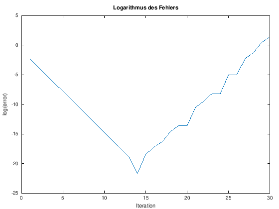

---
redirect_from:
  - "/00-einleitung/matlab-command-window"
interact_link: content/00_einleitung/matlab_command_window.ipynb
kernel_name: octave
title: 'Matlab Command Window'
prev_page:
  url: /00_einleitung/matlab_first_steps
  title: 'Erste Schritte in Matlab'
next_page:
  url: /emptypage
  title: 'Skripte und Funktionen'
comment: "***PROGRAMMATICALLY GENERATED, DO NOT EDIT. SEE ORIGINAL FILES IN /content***"
---

# Command Window

Im *Command Window* gibt man, wie der Name schon sagt, Befehle ein. Diese werden unmittelbar nach dem *Prompt* ```>>``` eingetippt. 

## Einfache Befehle

Gibt man zum Beispiel ```a=5``` ein, erscheint ein feedback, dass die Variable ```a``` erstellt wurde, und sie den Wert ```5``` zugewiesen bekommen hat.


{:.input_area}
```matlab
a = 5
```


{:.output .output_stream}
```
a =  5

```

MATLAB gibt nach Eingabe eines Kommandos immer eine Rückmeldung, in diesem Fall wird die Variable noch einmal ausgegeben. Diese Rückmeldung kann mit Hilfe des Semikolons unterdrückt werden:


{:.input_area}
```matlab
b = 2*pi;
```


Beide Variablen sind nun im Workspace hinterlegt, und können für weitere Berechnungen benutzt werden. Ich kann mir zum Beispiel den Wert von ```b``` ausgeben lassen,


{:.input_area}
```matlab
b
```


{:.output .output_stream}
```
b =  6.2832

```

oder einfache Rechenoperationen ausführen:


{:.input_area}
```matlab
b/a + i*sin(pi/8)
```


{:.output .output_stream}
```
ans =  1.25664 + 0.38268i

```

Das Ergebnis der Rechnung wird unter dem Variablennamen ```ans``` im Workspace hinterlegt. Ich kann dem Ergebnis explizit einen Variablennamen, hier ```c``` zuordnen:


{:.input_area}
```matlab
c = b/a + i*sin(pi/8)
```


{:.output .output_stream}
```
c =  1.25664 + 0.38268i

```

Wenn ich möchte, kann ich die Ausgabe des Ergebnisses unterdrücken, indem ich die Zeile mit einem Semikolon beende:


{:.input_area}
```matlab
d = exp(b/a - i*sin(pi/8));
```


Einige wichtige Punkte konnten wir bisher beobachten:

* Variablenzuweisungen passieren von links nach rechts: Was rechts vom Gleichheitszeichen steht, wird der Variablen die links vom Gleichheitszeichen steht zugeordnet. Wenn es diese Variable nicht gibt, wird sie im Workspace hinterlegt.
* Matlab bietet eine Vielzahl von mathematischen Funktionen an, die regelmäßig gebraucht werden, wie z.B. die Exponentialfunktion ```exp``` oder das Rechnen mit komplexen Zahlen.
* Alle Variablen werden im Workspace hinterlegt und können anschließend für weitere Berechnungen verwendent werden.
* In Matlab werden die skalaren Datentypen (```integer```, ```double```, ```float```, ...) nicht explizit angegeben, wie man es von Sprachen wie C oder C++ vielleicht gewöhnt ist. Auch wenn die Variablen ```a``` ganzzahlig ist, geht Matlab standardmäßig von ```double``` aus. Der Typ einer Variable lässt sich in Matlab durch die Funktion ```class()``` ausgeben lassen:


{:.input_area}
```matlab
class(a)
```


{:.output .output_stream}
```
ans = double

```

## Vektoren und Matrizen

Matlab ist ein Kofferwort aus **Mat**rix-**Lab**oratory. Der Name impliziert schon, dass es sich ideal dazu eignet mit Matrizen und Vektoren zu arbeiten. Dabei wird nicht zwischen den beiden unterschieden: Ein Zeilenvektor mit $n$ Einträgen ist einfach eine Matrix aus $\mathbb{R}^{1 \times n}$, während ein Spaltenvektor mit $n$ Einträgen eine Matrix aus $\mathbb{R}^{n \times 1}$ ist.

In Matlab werden Matrizen mit eckigen Klammern geschrieben, ein Semikolon beendet eine Zeile:


{:.input_area}
```matlab
e = [1, 2, 3, 4, 5] % ein Zeilenvektor
f = [1; 2; 3; 4; 5] % ein Spaltenvektor
```


{:.output .output_stream}
```
e =

   1   2   3   4   5

f =

   1
   2
   3
   4
   5


```

Beim Produkt zweier Vektoren $\mathbf{e}$ und $\mathbf{f}$ (byw. Matrixprodukt zweier Matrizen) ist stets darauf zu achten, dass die Dimensionen zueinander passen! Kann ich die eben erstellten Vektoren $e$ und $f$ miteinander multiplizieren?


{:.input_area}
```matlab
e*f
```


{:.output .output_stream}
```
ans =  55

```

Aha, bei Multiplikation eines $(1,n)$-dimensionalen Vektors $\mathbf{e}$ mit einem $(n,1)$-dimensionalen Vektor $\mathbf{f}$ erhalte ich eine Zahl, bzw. eine $(1,1)$-dimensionale Matrix mit nur einem Eintrag. Wir erhalten das **Skalarprodukt**

$$ \mathbf{e} \cdot \mathbf{f} = \sum_{i=1}^n e_i \cdot f_i. $$


{:.input_area}
```matlab
f*e
```


{:.output .output_stream}
```
ans =

    1    2    3    4    5
    2    4    6    8   10
    3    6    9   12   15
    4    8   12   16   20
    5   10   15   20   25


```

Die Multiplikation eines $(n,1)$-dimensionalen Vektors $\mathbf{f}$ mit einem (1,n)-dimensionalen Vektor $\mathbf{e}$ liefert mit also eine $(n,n)$-dimensionale Matrix. Es handelt sich um das **diadische Produkt**

$$ A = \mathbf{f} \cdot \mathbf{e}, \hskip0.5cm A_{ij} = f_i \cdot e_j $$

Wie sieht es mit den folgenden Matrizen aus?


{:.input_area}
```matlab
g = [1; 1; 1];
h = [2; 2; 2];
g*h
```


{:.output .output_stream}
```
error: operator *: nonconformant arguments (op1 is 3x1, op2 is 3x1)

```

Nein! Es klappt nicht. Die Fehlermeldung gibt schon Auskunft darüber wieso, die Dimensionen der Matrizen passen nicht zusammen. 

*Hinweis:* Hier ist der Wortlaut der Octave-Fehlermeldung zusehen. Matlab gibt an dieser Stelle die folgende Fehlermeldung wieder:

```
Error using  * 
Incorrect dimensions for matrix multiplication. Check that the number of columns in
the first matrix matches the number of rows in the second matrix. To perform
elementwise multiplication, use '.*'.
```

Wir behelfen uns eines Tricks: Ein nachgestelltes Apostroph gibt die transponierte Matrix aus:


{:.input_area}
```matlab
g
```


{:.output .output_stream}
```
g =

   1
   1
   1


```


{:.input_area}
```matlab
size(g)
```


{:.output .output_stream}
```
ans =

   3   1


```


{:.input_area}
```matlab
g'
```


{:.output .output_stream}
```
ans =

   1   1   1


```


{:.input_area}
```matlab
size(g')
```


{:.output .output_stream}
```
ans =

   1   3


```

Das Skalarprodukt von $\mathbf{g}$ mit $\mathbf{h}$ können wir also doch ausrechnen:


{:.input_area}
```matlab
g'*h
```


{:.output .output_stream}
```
ans =  6

```

Sehr häufig ist es nützlich Operationen komponentenweise auszuführen. Nehmen wir zum Beispiel an, in einer kleinen Arbeitsgruppe arbeiten fünft Personen. Zwei Mitarbeiter haben Vollzeitstellen, d.h. 39.5 Stunden pro Woche, einer hat eine halbe Stelle und zwei studentische Hilfskräfte unterstützen jeweils mit acht Stunden pro Woche.. Die wöchentliche Arbeitszeit der Mitarbeiter hinterlegen wir in einem Vektor


{:.input_area}
```matlab
weekly_hours = [39.5, 19.5, 39.5, 8, 8];
```


Die stündlichen Bruttokosten der Mitarbeiterstellen in € schreiben wir ebenfalls in einen Vektor:


{:.input_area}
```matlab
costPerHour_brutto_euro = [57.5, 57.5, 40, 15, 15];
```


Wenn ich wissen möchte, wieviel die Mitarbeiter jeweils pro Woche kosten, muss ich die Vektoren komponentenweise miteinander multiplizieren. Das erreiche ich in Matlab, indem ich vor dem ```*```-Operator einen Punkt voranstelle, es ist also eine *punktweise* Operation, und keine Matrixmultiplikation:


{:.input_area}
```matlab
weekly_hours.*costPerHour_brutto_euro
```


{:.output .output_stream}
```
ans =

   2271.25   1121.25   1580.00    120.00    120.00


```

**Quiz:** Wie berechne ich die Gesamtkosten aller Mitarbeiter pro Woche mit nur einer Zeile in Matlab? *Hinweis: Das Ergebnis lautet 5212.5 €.*


{:.input_area}
```matlab
weekly_cost_total = ...
```


Malab hat einige Befehle um spezielle Matrizen zu erstellen. Einige der wichtigsten sind:


{:.input_area}
```matlab
eye(2);     % 2,2-Einheitsmatrix
ones(3,2);  % 3,2-Matrix gefuellt mit 1
zeros(2,4); % 2,4-Matrix gefuellt mit 0
rand(2);    % 2,2-Matrix mit gleichverteilten Zufallszahlen von 0 bis 1
randn(4);   % 4,4-Matrix mit normalverteilten Zufallszahlen um 0 und Standardabweichung 1
```


Natürlich bietet Matlab auch viele weitere Funktionen rund um Matrizen und Vektoren um uns das Leben zu erleichtern. So kann ein Gleichungssytem $A\cdot \mathbf{x} = \mathbf{b}$ einfach und effizient mit dem sogenannten **backslash**-Operator gelöst werden.


{:.input_area}
```matlab
A=[1,2,3;4,5,-6;7,8,9];
b=[0.1,0.2,0.3]';
x = A\b                     % x = inv(A)*b
```


{:.output .output_stream}
```
x =

  -3.3333e-02
   6.6667e-02
  -1.4456e-18


```

To Do: Matrix concatenation, slicing. Unerschied function und Skript, auf scope eingehen und Beispiele bringen


{:.input_area}
```matlab
B=[A, b;b', 1];
```


## Skripte schreiben

Das %-Zeichen läutet in MATLAB einen Kommentar ein.

* Wie in *ALLEN* Programmiersprachen gilt in MATLAB: ** Kommentieren Sie ihren Code! **

Wie in anderen Programmiersprachen können in MATLAB auch Schleifen verwendet werden. Die Syntax für eine for-Schleife ist


{:.input_area}
```matlab
for i=1:5
    f(i)=2^i;
end
```


Dabei wird der Vektor f automatisch in jedem Schleifendurchlauf um ein Element erweitert. Es ist zu beachten, dass in MATLAB auf das erste Element eines Vektors mit dem Index 1 zugegriffen wird. Weitere Schleifentypen sind in der Hilfe nachzulesen.


{:.input_area}
```matlab
x=linspace(-5,5,11);   % Ein Vektor mit Werten von -5 bis 5
y=x.^2;                % Ein Vektor y mit den zugehörigen Funktionswerten 

plot(x,y);             % Erstellen einer grafischen Darstellung
title('Mein erster plot')
xlabel('X-Achsenbeschriftung')
ylabel('Y-Achsenbeschriftung')
```


{:.output .output_png}


## Funktionen schreiben

* Funktionen werden normalerweise in einem eigenen m-file gespeichert, siehe das Handout zur Matlab Einführung.

* Kurze Funktionen (Einzeiler) können in Variablen, so genannten 'function handles' abgespeichert werden.


{:.input_area}
```matlab
% Die Unbekannten Größen einer function handle
% werden mit dem @-Symbol deklariert.
meineFunktion = @(x)  x.^2;

meineFunktion(2)
meineFunktion([2,3;4,5])
```


{:.output .output_stream}
```
ans =  4
ans =

    4    9
   16   25


```

# Binominialkoeffizienten

siehe Handout


{:.input_area}
```matlab
%% fac.m
% calculate the factorial of an integer n
function z = fac(n)
    if n==0
        z=1;
    else
        z=n*fac(n-1);
    end
end
```


{:.input_area}
```matlab
n=5;
k=3;
fac(5)/(fac(k)*fac(n-k))
```


{:.output .output_stream}
```
ans =  10

```

# Programmierübung 2: Rundungsfehler

siehe Handout


{:.input_area}
```matlab
max_iter=30;            % Anzahl der Iterationen
z = zeros(max_iter,1);  % Initialisiere Vektor für z aus Effizienzgründen
err = zeros(max_iter,1);% Initialisiere Vektor für err aus Effizienzgründen

z(1)=2*sqrt(2);         %Anfangswerte
err(1)=abs(pi-z(1))/pi;

for n=1:max_iter-1
    z(n+1)=2^(n+1.5)*sqrt(1-sqrt(1-4^(-n-1)*z(n)^2));
    err(n+1)=abs(pi-z(n+1))/pi;
end
```


Logarithmische Darstellung des Fehlers


{:.input_area}
```matlab
plot(log(err))
title('Logarithmus des Fehlers')
xlabel('Iteration')
ylabel('log(error)')
```


{:.output .output_png}



