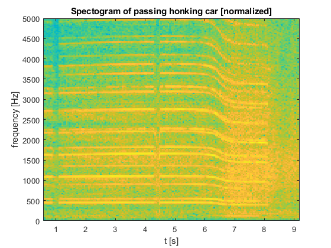

---
redirect_from:
  - "/01-schwingungen/exercises-01-doppler"
interact_link: content/01_schwingungen/exercises_01_doppler.ipynb
kernel_name: octave
has_widgets: false
title: 'Der Doppler Effekt'
prev_page:
  url: /01_schwingungen/intro
  title: 'Schwingungen'
next_page:
  url: /emptypage
  title: 'Lineare Gleichungssysteme'
comment: "***PROGRAMMATICALLY GENERATED, DO NOT EDIT. SEE ORIGINAL FILES IN /content***"
---

# Der Doppler Effekt

In [dem folgenden Video](https://www.youtube.com/watch?v=a3RfULw7aAY) ist kurz ein Verkehrsschild zu sehen: Hier ist eine Maximalgeschwindigkeit von 50 mph, bzw. ca. 80 km/h vorgeschrieben.

<iframe width="560" height="315" src="https://www.youtube.com/embed/a3RfULw7aAY?rel=0&amp;controls=0&amp;showinfo=0" frameborder="0" allowfullscreen></iframe>

Eine Frage drängt sich nahezu auf: ***Hält sich der Fahrer des laut hupenden Autos an diese Geschwindigkeitsbegrenzung?***


Eine weitere Sache fällt auf: Die Tonhöhe der Hupe ändert sich bei der Vorbeifahrt von einem hohen zu einem tiefen Ton. Dieses Phänomen wird als **Doppler Effekt** bezeichnet. Im Alltag macht er sich vor allem dann bemerkbar, wenn ein Krankenwagen oder ein Polizeiauto an einem vorbeifährt und sich der Klang der Sirene ändert. In dem Moment, in dem das Fahrzeug an einem vorbei fährt, klingt die Sirene plötzlich viel tiefer. Er ist auch die Ursache für den charakteristischen Klang von Rennautos, wenn sie an der Zuschauertribüne vorbeirasen.

## Frequenzanalyse

Mit einem beliebigen Online *Youtube-zu-mp3-Converter* lässt sich die Tonspur des Videos extrahieren und mit der Funktion `audioread` in Matlab einlesen. Mit Hilfe der Signalverarbeitungstoolbox kann man sich dann ein Spektrogramm erstellen:



Auf der x-Achse ist die Zeit und auf der y-Achse die Frequenz aufgetragen. Die Farbe gibt eine Auskunft über die dominanten Frequenzen zu jedem Zeitpunkt. Zwischen Sekunde 6 und Sekunde 7 fährt das Auto am Kameramann vorbei und der Abfall in der Tonhöhe ist gut zu erkennen.

Die vielen horizontalen Linien sind ein Zeichen dafür, dass die Hupe des Fahrzeuges keinen reinen Sinuston erzeugt, sondern eine Überlagerung vieler Frequenzen ist. Eine sogenannte Fouriertransformation der Tonspur gibt uns Auskunft über die dominanten Frequenzen im gesamten Zeitfenster:


Für jede horizontale Linie im Spektrogramm erhalten wir einen Peak in der Fouriertransformation. Der Ton der Hupe ist also eine Überlagerung von hauptsächlich drei Tönen bzw. Frequenzen.  
- Die dominanteste Frequenz von 1658 Hz (*[dreigestrichenes gis](https://www.youtube.com/watch?v=rv6XQwmpJAE)*) fällt beim Vorbeifahren auf 1449 Hz herab.
- Die zweite Frequenz von 1104 Hz fällt beim Vorbeifahren auf 964 Hz ab.
- Die dritte Frequenz von 456 Hz fällt herab auf 399 Hz.

## Ursache des Dopplereffektes

Die Hupe des Fahrzeuges erzeugt einen Ton, oder mit anderen Worten, regt die umgebende Luft zum Schwingen an. Wenn diese Schwingungen auf unser Ohr treffen, nehmen wir sie als Ton wahr.  Das Geräusch der Hupe breitet sich mit der Schallgeschwindigkeit von ca. 340 m/s im Raum aus. 

Die Schallwellen breiten sich kreisförmig vom Auto aus. Wenn das Fahrzeug in Bewegung ist werden die Wellenberge vor dem Auto gestaucht und hinter dem Auto gestreckt, da es in eine Richtung den zuvor ausgesendeten Schallwellen hinterher fährt.


Die gestauchten Wellenberge vor dem Fahrzeug haben also eine höhere Frequenz als die gestreckten Wellenberge hinter dem Fahrzeug und werden deshalb auch als höherer Ton wahrgenommen.


<div style="text-align: right"><a href="https://commons.wikimedia.org/wiki/File:Dopplerfrequenz.gif" > [CC BY-SA 3.0], via Wikimedia Commons </a></div>

## Zurück zur ursprünglichen Fragestellung

Wie schnell fährt denn nun das Auto?

<div markdown="1" class="cell code_cell">
<div class="input_area" markdown="1">
```matlab
f1 = [1658, 1104, 456];  % frequencies approaching
f2 = [1449,  964, 399];  % frequencies retreating

c = 340;                  % speed of sound [m/s]
km_to_miles = 0.621371;   % [miles/kilometer]

% f1/f2 = (1+v/c)/(1-v/c) =>
v = c*(f1 - f2)./(f1 + f2); %in  [m/s]


v_kmh = v*3.6;
v_mph = v_kmh*km_to_miles
```
</div>

<div class="output_wrapper" markdown="1">
<div class="output_subarea" markdown="1">
{:.output_stream}
```
v_mph =

   51.161   51.488   50.704

```
</div>
</div>
</div>


