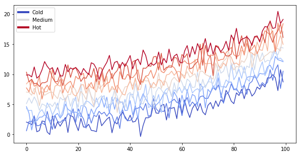

# Content with notebooks

You can also create content with Jupyter Notebooks. The content for the current page is contained
in a Jupyter Notebook in the `notebooks/` folder of the repository. This means that we can include
code blocks and their outputs, and export them to Jekyll markdown.

**You can find the original notebook for this page [at this address](https://github.com/jupyter/textbooks-with-jupyter/blob/master/notebooks/introduction/notebooks.ipynb)**

## Markdown + notebooks

As it is markdown, you can embed images, HTML, etc into your posts!


You an also $add_{math}$ and

$$
math^{blocks}
$$

or

$$
\begin{align*}
\mbox{mean} la_{tex} \\ \\
math blocks
\end{align*}
$$

But make sure you \\$Escape \\$your \\$dollar signs \\$you want to keep!

## Code blocks and image outputs

Textbooks with Jupyter will also embed your code blocks and output in your site.
For example, here's some sample Matplotlib code:


{:.input_area}
```python
from matplotlib import rcParams, cycler
import matplotlib.pyplot as plt
import numpy as np
plt.ion()
```


{:.input_area}
```python
# Fixing random state for reproducibility
np.random.seed(19680801)

N = 10
data = [np.logspace(0, 1, 100) + np.random.randn(100) + ii for ii in range(N)]
data = np.array(data).T
cmap = plt.cm.coolwarm
rcParams['axes.prop_cycle'] = cycler(color=cmap(np.linspace(0, 1, N)))


from matplotlib.lines import Line2D
custom_lines = [Line2D([0], [0], color=cmap(0.), lw=4),
                Line2D([0], [0], color=cmap(.5), lw=4),
                Line2D([0], [0], color=cmap(1.), lw=4)]

fig, ax = plt.subplots(figsize=(10, 5))
lines = ax.plot(data)
ax.legend(custom_lines, ['Cold', 'Medium', 'Hot']);
```


{:.output .output_png}



Note that the image above is captured and displayed by Jekyll.

## Removing content before publishing

You can also remove some content before publishing your book to the web. For example,
in [the original notebook](https://github.com/jupyter/jupyter-book/blob/master/notebooks/introduction/notebooks.ipynb) there
used to be a cell below...

You can also **remove only the code** so that images and other output still show up.

Below we'll *only* display an image. It was generated with Python code in a cell,
which you can [see in the original notebook](https://github.com/jupyter/jupyter-book/blob/master/notebooks/introduction/notebooks.ipynb)


{:.output .output_png}


And here we'll *only* display a Pandas DataFrame. Again, this was generated with Python code
from [this original notebook](https://github.com/jupyter/textbooks-with-jupyter/blob/master/notebooks/introduction/notebooks.ipynb).


<div markdown="0" class="output output_html">
<div>
<style scoped>
    .dataframe tbody tr th:only-of-type {
        vertical-align: middle;
    }

    .dataframe tbody tr th {
        vertical-align: top;
    }

    .dataframe thead th {
        text-align: right;
    }
</style>
<table border="1" class="dataframe">
  <thead>
    <tr style="text-align: right;">
      <th></th>
      <th>Word A</th>
      <th>Word B</th>
    </tr>
  </thead>
  <tbody>
    <tr>
      <th>0</th>
      <td>hi</td>
      <td>there</td>
    </tr>
    <tr>
      <th>1</th>
      <td>this</td>
      <td>is</td>
    </tr>
    <tr>
      <th>2</th>
      <td>a</td>
      <td>DataFrame</td>
    </tr>
  </tbody>
</table>
</div>
</div>


You can configure the text that *Textbooks with Jupyter* uses for this by modifying your site's `_config.yml` file.

## Interactive outputs

We can even do the same for *interactive* material. Below we'll display a map using `ipyleaflet`. When the notebook
is converted to Markdown, the code for creating the interactive map is retained.

**Note that this will only work for some packages.** They need to be able to output standalone HTML/Javascript, and not
depend on an underlying Python kernel to work.


{:.input_area}
```python
import folium
```


{:.input_area}
```python
m = folium.Map(
    location=[45.372, -121.6972],
    zoom_start=12,
    tiles='Stamen Terrain'
)

folium.Marker(
    location=[45.3288, -121.6625],
    popup='Mt. Hood Meadows',
    icon=folium.Icon(icon='cloud')
).add_to(m)

folium.Marker(
    location=[45.3311, -121.7113],
    popup='Timberline Lodge',
    icon=folium.Icon(color='green')
).add_to(m)

folium.Marker(
    location=[45.3300, -121.6823],
    popup='Some Other Location',
    icon=folium.Icon(color='red', icon='info-sign')
).add_to(m)


m

```


<div markdown="0" class="output output_html">
<div style="width:100%;"><div style="position:relative;width:100%;height:0;padding-bottom:60%;"><iframe src="data:text/html;charset=utf-8;base64,PCFET0NUWVBFIGh0bWw+CjxoZWFkPiAgICAKICAgIDxtZXRhIGh0dHAtZXF1aXY9ImNvbnRlbnQtdHlwZSIgY29udGVudD0idGV4dC9odG1sOyBjaGFyc2V0PVVURi04IiAvPgogICAgPHNjcmlwdD5MX1BSRUZFUl9DQU5WQVM9ZmFsc2U7IExfTk9fVE9VQ0g9ZmFsc2U7IExfRElTQUJMRV8zRD1mYWxzZTs8L3NjcmlwdD4KICAgIDxzY3JpcHQgc3JjPSJodHRwczovL2Nkbi5qc2RlbGl2ci5uZXQvbnBtL2xlYWZsZXRAMS4zLjQvZGlzdC9sZWFmbGV0LmpzIj48L3NjcmlwdD4KICAgIDxzY3JpcHQgc3JjPSJodHRwczovL2FqYXguZ29vZ2xlYXBpcy5jb20vYWpheC9saWJzL2pxdWVyeS8xLjExLjEvanF1ZXJ5Lm1pbi5qcyI+PC9zY3JpcHQ+CiAgICA8c2NyaXB0IHNyYz0iaHR0cHM6Ly9tYXhjZG4uYm9vdHN0cmFwY2RuLmNvbS9ib290c3RyYXAvMy4yLjAvanMvYm9vdHN0cmFwLm1pbi5qcyI+PC9zY3JpcHQ+CiAgICA8c2NyaXB0IHNyYz0iaHR0cHM6Ly9jZG5qcy5jbG91ZGZsYXJlLmNvbS9hamF4L2xpYnMvTGVhZmxldC5hd2Vzb21lLW1hcmtlcnMvMi4wLjIvbGVhZmxldC5hd2Vzb21lLW1hcmtlcnMuanMiPjwvc2NyaXB0PgogICAgPGxpbmsgcmVsPSJzdHlsZXNoZWV0IiBocmVmPSJodHRwczovL2Nkbi5qc2RlbGl2ci5uZXQvbnBtL2xlYWZsZXRAMS4zLjQvZGlzdC9sZWFmbGV0LmNzcyIvPgogICAgPGxpbmsgcmVsPSJzdHlsZXNoZWV0IiBocmVmPSJodHRwczovL21heGNkbi5ib290c3RyYXBjZG4uY29tL2Jvb3RzdHJhcC8zLjIuMC9jc3MvYm9vdHN0cmFwLm1pbi5jc3MiLz4KICAgIDxsaW5rIHJlbD0ic3R5bGVzaGVldCIgaHJlZj0iaHR0cHM6Ly9tYXhjZG4uYm9vdHN0cmFwY2RuLmNvbS9ib290c3RyYXAvMy4yLjAvY3NzL2Jvb3RzdHJhcC10aGVtZS5taW4uY3NzIi8+CiAgICA8bGluayByZWw9InN0eWxlc2hlZXQiIGhyZWY9Imh0dHBzOi8vbWF4Y2RuLmJvb3RzdHJhcGNkbi5jb20vZm9udC1hd2Vzb21lLzQuNi4zL2Nzcy9mb250LWF3ZXNvbWUubWluLmNzcyIvPgogICAgPGxpbmsgcmVsPSJzdHlsZXNoZWV0IiBocmVmPSJodHRwczovL2NkbmpzLmNsb3VkZmxhcmUuY29tL2FqYXgvbGlicy9MZWFmbGV0LmF3ZXNvbWUtbWFya2Vycy8yLjAuMi9sZWFmbGV0LmF3ZXNvbWUtbWFya2Vycy5jc3MiLz4KICAgIDxsaW5rIHJlbD0ic3R5bGVzaGVldCIgaHJlZj0iaHR0cHM6Ly9yYXdjZG4uZ2l0aGFjay5jb20vcHl0aG9uLXZpc3VhbGl6YXRpb24vZm9saXVtL21hc3Rlci9mb2xpdW0vdGVtcGxhdGVzL2xlYWZsZXQuYXdlc29tZS5yb3RhdGUuY3NzIi8+CiAgICA8c3R5bGU+aHRtbCwgYm9keSB7d2lkdGg6IDEwMCU7aGVpZ2h0OiAxMDAlO21hcmdpbjogMDtwYWRkaW5nOiAwO308L3N0eWxlPgogICAgPHN0eWxlPiNtYXAge3Bvc2l0aW9uOmFic29sdXRlO3RvcDowO2JvdHRvbTowO3JpZ2h0OjA7bGVmdDowO308L3N0eWxlPgogICAgCiAgICA8bWV0YSBuYW1lPSJ2aWV3cG9ydCIgY29udGVudD0id2lkdGg9ZGV2aWNlLXdpZHRoLAogICAgICAgIGluaXRpYWwtc2NhbGU9MS4wLCBtYXhpbXVtLXNjYWxlPTEuMCwgdXNlci1zY2FsYWJsZT1ubyIgLz4KICAgIDxzdHlsZT4jbWFwXzgwZTY4MzY2ODgxZDQ2ZDM4N2U1M2FiOGM2ZmRkNDU1IHsKICAgICAgICBwb3NpdGlvbjogcmVsYXRpdmU7CiAgICAgICAgd2lkdGg6IDEwMC4wJTsKICAgICAgICBoZWlnaHQ6IDEwMC4wJTsKICAgICAgICBsZWZ0OiAwLjAlOwogICAgICAgIHRvcDogMC4wJTsKICAgICAgICB9CiAgICA8L3N0eWxlPgo8L2hlYWQ+Cjxib2R5PiAgICAKICAgIAogICAgPGRpdiBjbGFzcz0iZm9saXVtLW1hcCIgaWQ9Im1hcF84MGU2ODM2Njg4MWQ0NmQzODdlNTNhYjhjNmZkZDQ1NSIgPjwvZGl2Pgo8L2JvZHk+CjxzY3JpcHQ+ICAgIAogICAgCiAgICAKICAgICAgICB2YXIgYm91bmRzID0gbnVsbDsKICAgIAoKICAgIHZhciBtYXBfODBlNjgzNjY4ODFkNDZkMzg3ZTUzYWI4YzZmZGQ0NTUgPSBMLm1hcCgKICAgICAgICAnbWFwXzgwZTY4MzY2ODgxZDQ2ZDM4N2U1M2FiOGM2ZmRkNDU1JywgewogICAgICAgIGNlbnRlcjogWzQ1LjM3MiwgLTEyMS42OTcyXSwKICAgICAgICB6b29tOiAxMiwKICAgICAgICBtYXhCb3VuZHM6IGJvdW5kcywKICAgICAgICBsYXllcnM6IFtdLAogICAgICAgIHdvcmxkQ29weUp1bXA6IGZhbHNlLAogICAgICAgIGNyczogTC5DUlMuRVBTRzM4NTcsCiAgICAgICAgem9vbUNvbnRyb2w6IHRydWUsCiAgICAgICAgfSk7CgogICAgCiAgICAKICAgIHZhciB0aWxlX2xheWVyX2YwOTFkZTUwZjU2YTRjMTI4YmQ2NDUwOTA0MjY1ZmM4ID0gTC50aWxlTGF5ZXIoCiAgICAgICAgJ2h0dHBzOi8vc3RhbWVuLXRpbGVzLXtzfS5hLnNzbC5mYXN0bHkubmV0L3RlcnJhaW4ve3p9L3t4fS97eX0uanBnJywKICAgICAgICB7CiAgICAgICAgImF0dHJpYnV0aW9uIjogbnVsbCwKICAgICAgICAiZGV0ZWN0UmV0aW5hIjogZmFsc2UsCiAgICAgICAgIm1heE5hdGl2ZVpvb20iOiAxOCwKICAgICAgICAibWF4Wm9vbSI6IDE4LAogICAgICAgICJtaW5ab29tIjogMCwKICAgICAgICAibm9XcmFwIjogZmFsc2UsCiAgICAgICAgIm9wYWNpdHkiOiAxLAogICAgICAgICJzdWJkb21haW5zIjogImFiYyIsCiAgICAgICAgInRtcyI6IGZhbHNlCn0pLmFkZFRvKG1hcF84MGU2ODM2Njg4MWQ0NmQzODdlNTNhYjhjNmZkZDQ1NSk7CiAgICAKICAgICAgICB2YXIgbWFya2VyXzJhZmUxNDBhNjRhYzQyOTlhNWQyMjY1ZGQxZmUxYjgxID0gTC5tYXJrZXIoCiAgICAgICAgICAgIFs0NS4zMjg4LCAtMTIxLjY2MjVdLAogICAgICAgICAgICB7CiAgICAgICAgICAgICAgICBpY29uOiBuZXcgTC5JY29uLkRlZmF1bHQoKQogICAgICAgICAgICAgICAgfQogICAgICAgICAgICApLmFkZFRvKG1hcF84MGU2ODM2Njg4MWQ0NmQzODdlNTNhYjhjNmZkZDQ1NSk7CiAgICAgICAgCiAgICAKCiAgICAgICAgICAgICAgICB2YXIgaWNvbl8wZGFhMTk2OThhNmQ0ZDc2OWU0NTVmZDg4MTJkZWU3MSA9IEwuQXdlc29tZU1hcmtlcnMuaWNvbih7CiAgICAgICAgICAgICAgICAgICAgaWNvbjogJ2Nsb3VkJywKICAgICAgICAgICAgICAgICAgICBpY29uQ29sb3I6ICd3aGl0ZScsCiAgICAgICAgICAgICAgICAgICAgbWFya2VyQ29sb3I6ICdibHVlJywKICAgICAgICAgICAgICAgICAgICBwcmVmaXg6ICdnbHlwaGljb24nLAogICAgICAgICAgICAgICAgICAgIGV4dHJhQ2xhc3NlczogJ2ZhLXJvdGF0ZS0wJwogICAgICAgICAgICAgICAgICAgIH0pOwogICAgICAgICAgICAgICAgbWFya2VyXzJhZmUxNDBhNjRhYzQyOTlhNWQyMjY1ZGQxZmUxYjgxLnNldEljb24oaWNvbl8wZGFhMTk2OThhNmQ0ZDc2OWU0NTVmZDg4MTJkZWU3MSk7CiAgICAgICAgICAgIAogICAgCiAgICAgICAgICAgIHZhciBwb3B1cF8wYTdjZDA3ZWViY2Q0NGFjOTIwNzJhYjAzMjdiYWZlZCA9IEwucG9wdXAoe21heFdpZHRoOiAnMzAwJwogICAgICAgICAgICAKICAgICAgICAgICAgfSk7CgogICAgICAgICAgICAKICAgICAgICAgICAgICAgIHZhciBodG1sXzkyYjc4MWEyOGMxNDQ2MmFiOTJmNGMzMDE5NDU2NGY1ID0gJChgPGRpdiBpZD0iaHRtbF85MmI3ODFhMjhjMTQ0NjJhYjkyZjRjMzAxOTQ1NjRmNSIgc3R5bGU9IndpZHRoOiAxMDAuMCU7IGhlaWdodDogMTAwLjAlOyI+TXQuIEhvb2QgTWVhZG93czwvZGl2PmApWzBdOwogICAgICAgICAgICAgICAgcG9wdXBfMGE3Y2QwN2VlYmNkNDRhYzkyMDcyYWIwMzI3YmFmZWQuc2V0Q29udGVudChodG1sXzkyYjc4MWEyOGMxNDQ2MmFiOTJmNGMzMDE5NDU2NGY1KTsKICAgICAgICAgICAgCgogICAgICAgICAgICBtYXJrZXJfMmFmZTE0MGE2NGFjNDI5OWE1ZDIyNjVkZDFmZTFiODEuYmluZFBvcHVwKHBvcHVwXzBhN2NkMDdlZWJjZDQ0YWM5MjA3MmFiMDMyN2JhZmVkKQogICAgICAgICAgICA7CgogICAgICAgICAgICAKICAgICAgICAKICAgIAogICAgICAgIHZhciBtYXJrZXJfZDFiYjA5OTRiNjlhNDMwNzhkYTMyYmI5NzYwNjU0YjIgPSBMLm1hcmtlcigKICAgICAgICAgICAgWzQ1LjMzMTEsIC0xMjEuNzExM10sCiAgICAgICAgICAgIHsKICAgICAgICAgICAgICAgIGljb246IG5ldyBMLkljb24uRGVmYXVsdCgpCiAgICAgICAgICAgICAgICB9CiAgICAgICAgICAgICkuYWRkVG8obWFwXzgwZTY4MzY2ODgxZDQ2ZDM4N2U1M2FiOGM2ZmRkNDU1KTsKICAgICAgICAKICAgIAoKICAgICAgICAgICAgICAgIHZhciBpY29uX2Q5M2IxYTM1NGIxMDRjYzg4MTUyNGMxN2Y1OWIwNDVkID0gTC5Bd2Vzb21lTWFya2Vycy5pY29uKHsKICAgICAgICAgICAgICAgICAgICBpY29uOiAnaW5mby1zaWduJywKICAgICAgICAgICAgICAgICAgICBpY29uQ29sb3I6ICd3aGl0ZScsCiAgICAgICAgICAgICAgICAgICAgbWFya2VyQ29sb3I6ICdncmVlbicsCiAgICAgICAgICAgICAgICAgICAgcHJlZml4OiAnZ2x5cGhpY29uJywKICAgICAgICAgICAgICAgICAgICBleHRyYUNsYXNzZXM6ICdmYS1yb3RhdGUtMCcKICAgICAgICAgICAgICAgICAgICB9KTsKICAgICAgICAgICAgICAgIG1hcmtlcl9kMWJiMDk5NGI2OWE0MzA3OGRhMzJiYjk3NjA2NTRiMi5zZXRJY29uKGljb25fZDkzYjFhMzU0YjEwNGNjODgxNTI0YzE3ZjU5YjA0NWQpOwogICAgICAgICAgICAKICAgIAogICAgICAgICAgICB2YXIgcG9wdXBfMTU5Y2NmNjY1ZjZmNGYxZDhjNTM4MmM2NmU3NTUzY2IgPSBMLnBvcHVwKHttYXhXaWR0aDogJzMwMCcKICAgICAgICAgICAgCiAgICAgICAgICAgIH0pOwoKICAgICAgICAgICAgCiAgICAgICAgICAgICAgICB2YXIgaHRtbF8wMzBmNTFlM2Q2MGY0YmUxYTRkZmY4MjIzYjQwODAzNSA9ICQoYDxkaXYgaWQ9Imh0bWxfMDMwZjUxZTNkNjBmNGJlMWE0ZGZmODIyM2I0MDgwMzUiIHN0eWxlPSJ3aWR0aDogMTAwLjAlOyBoZWlnaHQ6IDEwMC4wJTsiPlRpbWJlcmxpbmUgTG9kZ2U8L2Rpdj5gKVswXTsKICAgICAgICAgICAgICAgIHBvcHVwXzE1OWNjZjY2NWY2ZjRmMWQ4YzUzODJjNjZlNzU1M2NiLnNldENvbnRlbnQoaHRtbF8wMzBmNTFlM2Q2MGY0YmUxYTRkZmY4MjIzYjQwODAzNSk7CiAgICAgICAgICAgIAoKICAgICAgICAgICAgbWFya2VyX2QxYmIwOTk0YjY5YTQzMDc4ZGEzMmJiOTc2MDY1NGIyLmJpbmRQb3B1cChwb3B1cF8xNTljY2Y2NjVmNmY0ZjFkOGM1MzgyYzY2ZTc1NTNjYikKICAgICAgICAgICAgOwoKICAgICAgICAgICAgCiAgICAgICAgCiAgICAKICAgICAgICB2YXIgbWFya2VyX2JkYTU0Yzc3YmU0YjRlODZiNDgyZTMzNjhjNmEyNThmID0gTC5tYXJrZXIoCiAgICAgICAgICAgIFs0NS4zMywgLTEyMS42ODIzXSwKICAgICAgICAgICAgewogICAgICAgICAgICAgICAgaWNvbjogbmV3IEwuSWNvbi5EZWZhdWx0KCkKICAgICAgICAgICAgICAgIH0KICAgICAgICAgICAgKS5hZGRUbyhtYXBfODBlNjgzNjY4ODFkNDZkMzg3ZTUzYWI4YzZmZGQ0NTUpOwogICAgICAgIAogICAgCgogICAgICAgICAgICAgICAgdmFyIGljb25fODY1MTBkZTIwNzcxNDVlYmI1OWM1MDJiYWNjZGFkZjQgPSBMLkF3ZXNvbWVNYXJrZXJzLmljb24oewogICAgICAgICAgICAgICAgICAgIGljb246ICdpbmZvLXNpZ24nLAogICAgICAgICAgICAgICAgICAgIGljb25Db2xvcjogJ3doaXRlJywKICAgICAgICAgICAgICAgICAgICBtYXJrZXJDb2xvcjogJ3JlZCcsCiAgICAgICAgICAgICAgICAgICAgcHJlZml4OiAnZ2x5cGhpY29uJywKICAgICAgICAgICAgICAgICAgICBleHRyYUNsYXNzZXM6ICdmYS1yb3RhdGUtMCcKICAgICAgICAgICAgICAgICAgICB9KTsKICAgICAgICAgICAgICAgIG1hcmtlcl9iZGE1NGM3N2JlNGI0ZTg2YjQ4MmUzMzY4YzZhMjU4Zi5zZXRJY29uKGljb25fODY1MTBkZTIwNzcxNDVlYmI1OWM1MDJiYWNjZGFkZjQpOwogICAgICAgICAgICAKICAgIAogICAgICAgICAgICB2YXIgcG9wdXBfNGM4OGExMmMzOTQzNGM3MThjYTU1NTdhNjYxYmNkMTYgPSBMLnBvcHVwKHttYXhXaWR0aDogJzMwMCcKICAgICAgICAgICAgCiAgICAgICAgICAgIH0pOwoKICAgICAgICAgICAgCiAgICAgICAgICAgICAgICB2YXIgaHRtbF9iOWY3MjZmZTdjOGM0MTQzYTcxNzc0ZTQyYWYzY2NkNSA9ICQoYDxkaXYgaWQ9Imh0bWxfYjlmNzI2ZmU3YzhjNDE0M2E3MTc3NGU0MmFmM2NjZDUiIHN0eWxlPSJ3aWR0aDogMTAwLjAlOyBoZWlnaHQ6IDEwMC4wJTsiPlNvbWUgT3RoZXIgTG9jYXRpb248L2Rpdj5gKVswXTsKICAgICAgICAgICAgICAgIHBvcHVwXzRjODhhMTJjMzk0MzRjNzE4Y2E1NTU3YTY2MWJjZDE2LnNldENvbnRlbnQoaHRtbF9iOWY3MjZmZTdjOGM0MTQzYTcxNzc0ZTQyYWYzY2NkNSk7CiAgICAgICAgICAgIAoKICAgICAgICAgICAgbWFya2VyX2JkYTU0Yzc3YmU0YjRlODZiNDgyZTMzNjhjNmEyNThmLmJpbmRQb3B1cChwb3B1cF80Yzg4YTEyYzM5NDM0YzcxOGNhNTU1N2E2NjFiY2QxNikKICAgICAgICAgICAgOwoKICAgICAgICAgICAgCiAgICAgICAgCjwvc2NyaXB0Pg==" style="position:absolute;width:100%;height:100%;left:0;top:0;border:none !important;" allowfullscreen webkitallowfullscreen mozallowfullscreen></iframe></div></div>
</div>


