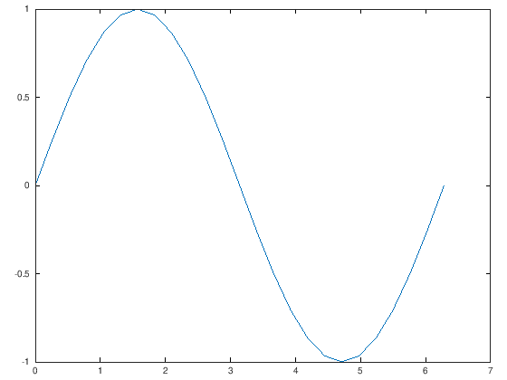

# Matlab Getting Started

Dieses Online-Tutorial basiert auf [GNU Octave](https://www.gnu.org/software/octave/), einer frei-verfügbaren Matlab-Alternative, das in den allermeisten Fällen Matlab Befehle korrekt interpretieren kann. Alle Beispiele die Sie hier finden werden, können Sie sowohl mit Octave als auch mit Matlab ausführen.

### Erstellen einfacher Graphen

Die folgenden beiden Zeilen erstellen einen Vektor $t$, der das Intervall $[0,2\pi]$ an 25 äquidistanten Punkten enthält und einen Vektor $y$, der an diesen Punkten die Funktion $y=sin(t)$ auswertet.


{:.input_area}
```octave
t = linspace(0,2*pi,25);
y = sin(t);
```


Wir schauen uns mal die ersten 5 Elemente der beiden Vektoren an. Wenn ein Matlab-Befehl ohne Semikolon geschrieben wird, wird das Ergebnis des Befehles ausgegeben.


{:.input_area}
```octave
t(1:5)
y(1:5)
```


{:.output .output_stream}
```
ans =

   0.00000   0.26180   0.52360   0.78540   1.04720

ans =

   0.00000   0.25882   0.50000   0.70711   0.86603


```

Nun wollen wir eine grafische Darstellung mit dem Befehl `plot` erzeugen. Wir wählen den Vektor $t$ für die x-Werte und den Vektor $y$ für die y-Werte. 


{:.input_area}
```octave
plot(t,y);
```


{:.output .output_png}



