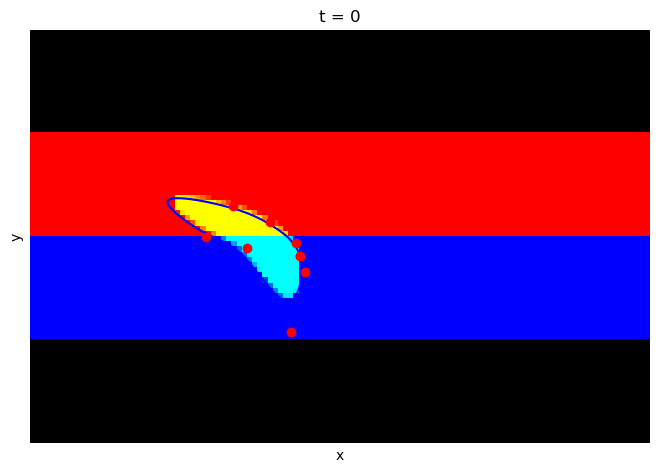

# Modellbildung und Simulation

An dieser Stelle entsteht in Kürze ein interaktives Übungsbuch zur Vorlesung __Modellbildung und Simulation__ an der [Hochschule Bonn-Rhein-Sieg](https://www.h-brs.de).

## Acknowledgements

Jupyter Books was originally created by [Sam Lau][sam] and [Chris Holdgraf][chris]
with support of the **UC Berkeley Data Science Education Program and the Berkeley
Institute for Data Science**.

[sam]: http://www.samlau.me/
[chris]: https://predictablynoisy.com
